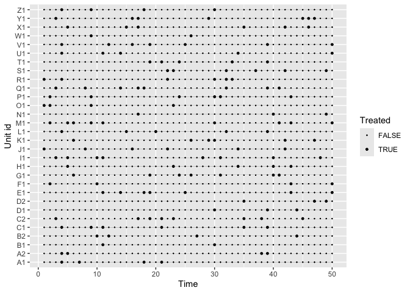
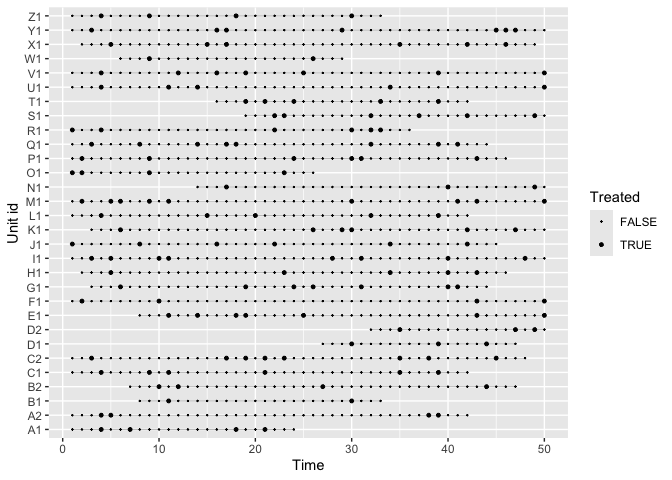
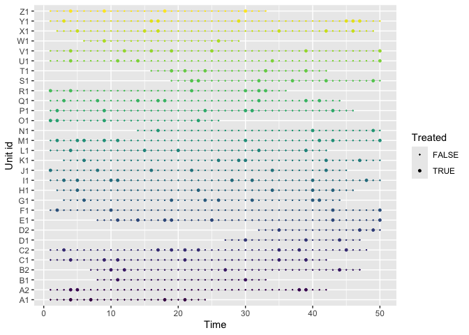

<!-- THE README.md IS GENERATED FROM README.Rmd. PLEASE EDIT THAT FILE -->

# Event Horizon

## Overview

An R Package to builds panels for event-study models based on a
user-specified time horizon for repeated interventions

The package is co-developed by Juan Carlos Villaseñor-Derbez and Renato
Molina.

## Installation

Install the development version with:

``` r
if(!require(devtools)) {install.packages("devtools")}

# install.packages("pak")
pak::pak("tidyverse/ggplot2")
```

## Usage

Here’s an example of how to use it

``` r
library(tidyr)
library(dplyr)
#> 
#> Attaching package: 'dplyr'
#> The following objects are masked from 'package:stats':
#> 
#>     filter, lag
#> The following objects are masked from 'package:base':
#> 
#>     intersect, setdiff, setequal, union
library(EventHorizon)


# Load a panel
panel <- simulate_panel(n_units = 30, n_periods = 50)

visualize_panel(panel)
```

<!-- -->

``` r

event_horizon_panel <- panel |>
mutate(treatment_id = treatment_ids(id = id, time = time, treatment = treatment, window = 3),
       relative_time = calculate_relative_time(id = id, time = time, treatment_id = treatment_id, window = 3),
       treatment_id = propagate_treatment_id(id = id, time = time, treatment_id = treatment_id, window = 3)) |>
drop_na(treatment_id)

visualize_panel(event_horizon_panel)
```

<!-- -->

``` r
visualize_panel(event_horizon_panel, prepped = T)
```

<!-- -->
